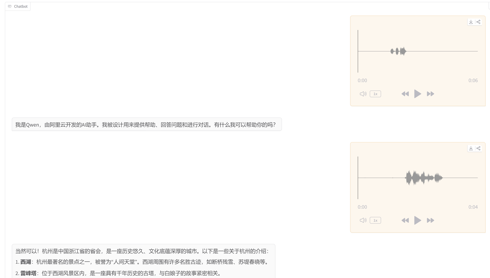
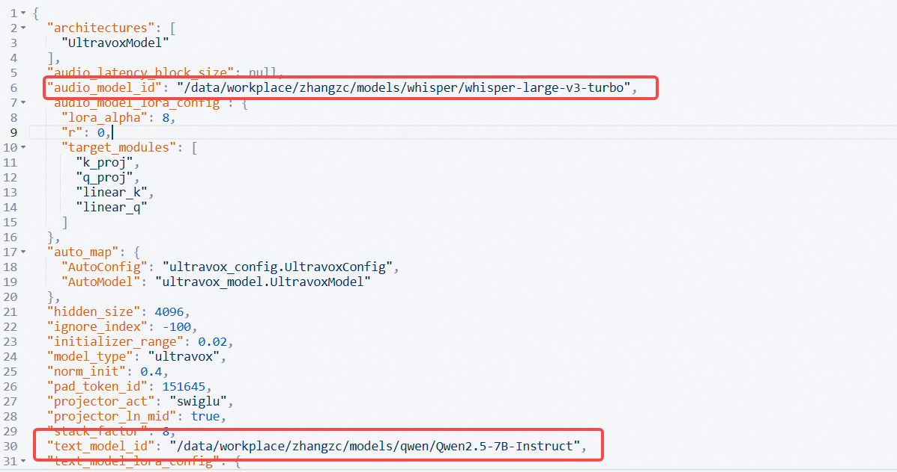

中文 | [English](README.md)

<p align="center">
  <picture>
    
  </picture>
</p>

<h3 align="center">
一款为实时语音交互设计的快速多模态LLM
</h3>


# 概述

Ultravox是一种新型的多模态LLM，能够理解文本和人类语音，无需单独的自动语音识别（ASR）阶段。基于[AudioLM](https://arxiv.org/abs/2209.03143)、[SeamlessM4T](https://ai.meta.com/blog/seamless-m4t/)、[Gazelle](https://tincans.ai/slm)、[SpeechGPT](https://github.com/0nutation/SpeechGPT/tree/main/speechgpt)等研究，Ultravox能够将任何开放权重LLM扩展为一个多模态投影器，直接将音频转换为LLM使用的高维空间。

ultravox官方仓库：[https://github.com/fixie-ai/ultravox](https://github.com/fixie-ai/ultravox)

ultravox-cn仓库：[https://github.com/seanzhang-zhichen/ultravox-cn](https://github.com/seanzhang-zhichen/ultravox-cn)

由于官方版本模型对中文支持较差，因此，我们训练了基于Qwen2.5-7B-Instruct和whisper-large-v3-turbo的中文友好的语音多模态模型

### 架构

[](https://docs.google.com/presentation/d/1ey81xuuMzrJaBwztb_Rq24Cit37GQokD2aAes_KkGVI/edit)


### 效果



### 模型

- Huggingface下载地址：[https://huggingface.co/zhichen/ultravox-cn](https://huggingface.co/zhichen/ultravox-cn)
- Modelscope下载地址：[https://modelscope.cn/models/seanzhang/ultravox-cn](https://modelscope.cn/models/seanzhang/ultravox-cn)


## 环境设置

安装`just`

```bash
git clone https://github.com/seanzhang-zhichen/ultravox-cn.git
cd ultravox-cn
sudo apt-get install just
conda create -n ultravox python=3.11
conda activate ultravox
just install
```

## 模型准备

运行demo前，需准备以下模型：

- Qwen2.5-7B-Instruct
- whisper-large-v3-turbo
- seanzhang/ultravox-cn

以上模型准备好后，修改seanzhang/ultravox-cn/config.json中的audio_model_id为本地whisper-large-v3-turbo路径，text_model_id为本地Qwen2.5-7B-Instruct路径。



### Web Demo

```bash
python ultravox/tools/gradio_demo.py --model_path seanzhang/ultravox-cn（或本地路径）   
```

